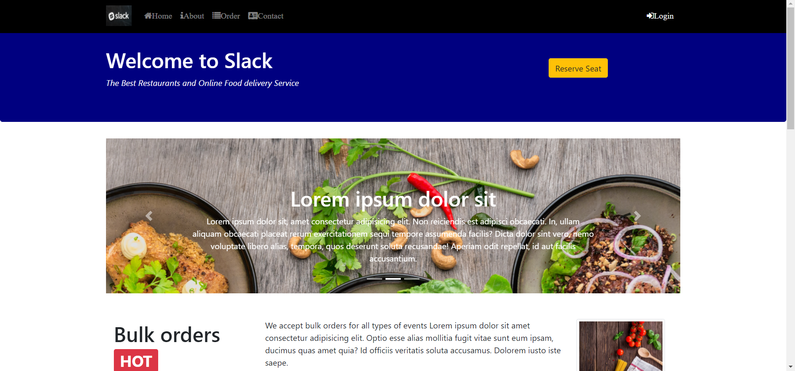
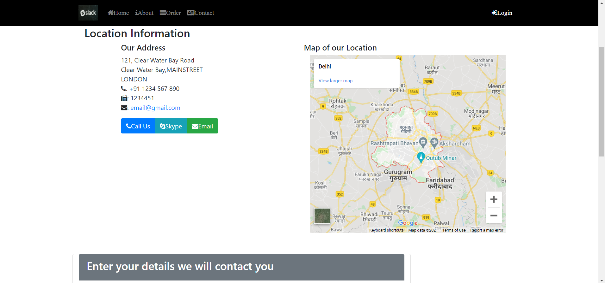
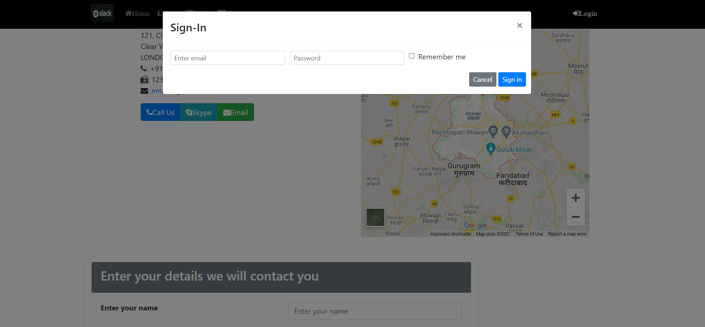

# Food Delivery Website [](https://twitter.com/intent/tweet?text=Bootstrap%20based%food%20&via=froala&hashtags=bootstrap,design,templates,blocks,developers)

Food Ordering Website

## Setup 

clone the website run 

# ``npm install``

```<link rel="stylesheet" href="node_modules/bootstrap/dist/css/bootstrap.min.css">```


Including the jquery and bootstrap javascripts


```<script src="node_modules/jquery/dist/jquery.slim.min.js"></script>```


```<script src="node_modules/popper.js/dist/umd/popper.min.js"></script>```


 ```<script src="node_modules/bootstrap/dist/js/bootstrap.min.js"></script>```




